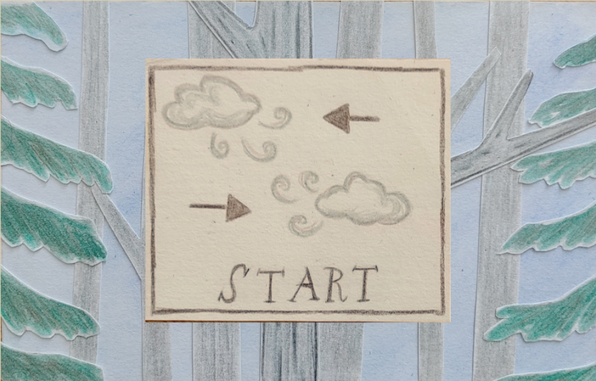
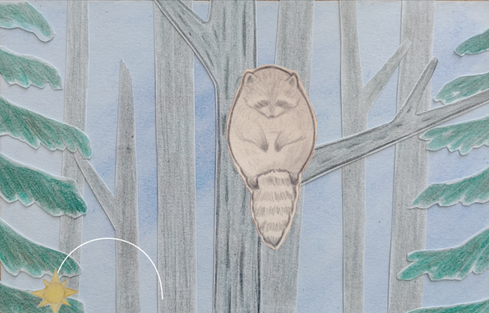

# Raccon Game

A short collage style game made for Gamedev.js Jam 2025.

This is a Phaser 3 project that uses the React framework and Vite for bundling. It includes a bridge for React to Phaser game communication, hot-reloading for quick development workflow and scripts to generate production-ready builds.

## Requirements

[Node.js](https://nodejs.org) is required to install dependencies and run scripts via `npm`.

## Available Commands

| Command | Description |
|---------|-------------|
| `npm install` | Install project dependencies |
| `npm run dev` | Launch a development web server |
| `npm run build` | Create a production build in the `dist` folder |
| `npm run dev-nolog` | Launch a development web server without sending anonymous data (see "About log.js" below) |
| `npm run build-nolog` | Create a production build in the `dist` folder without sending anonymous data (see "About log.js" below) |

## Project Structure

- `index.html` - A basic HTML page to contain the game.
- `src` - Contains the React client source code.
- `src/main.tsx` - The main **React** entry point. This bootstraps the React application.
- `src/vite-env.d.ts` - Global TypeScript declarations, provide types information.
- `src/App.tsx` - The main React component.
- `src/game/PhaserGame.tsx` - The React component that initializes the Phaser Game and serve like a bridge between React and Phaser.
- `src/game/EventBus.ts` - A simple event bus to communicate between React and Phaser.
- `src/game` - Contains the game source code.
- `src/game/main.tsx` - The main **game** entry point. This contains the game configuration and start the game.
- `src/game/scenes/` - The Phaser Scenes are in this folder.
- `src/game/scenes/Game` - The meat of the Game is here. Includes all of the logic, timers, sound play, etc.
- `src/game/scenes/GameOver` - The last scene is here, displays Yay if you win or Oh No if you lose.
- `src/game/scenes/MainMenu` - Start screen.
- `public/style.css` - Some simple CSS rules to help with page layout.
- `public/assets` - Contains the static assets used by the game.

